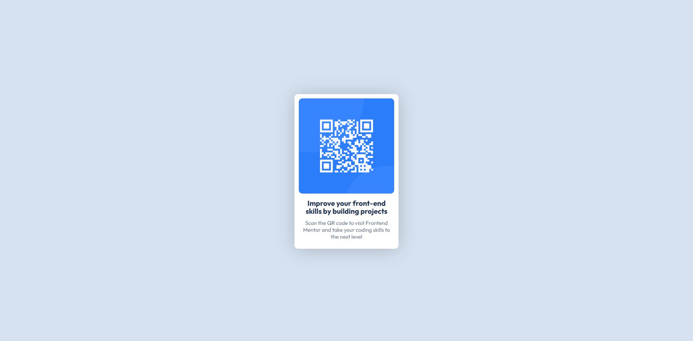

## Table of contents

- [Overview](#overview)
  - [Screenshot](#screenshot)
  - [Links](#links)
- [My process](#my-process)
  - [Built with](#built-with)
  - [What I learned](#what-i-learned)
  - [Continued development](#continued-development)
- [Author](#author)

## Overview

### Screenshot

### Links

- Solution URL: (https://github.com/sujwal19/development/tree/main/qr-code-component-main)
- Live Site URL: (https://qrcode-nine-umber.vercel.app/)

## My process

### Built with

- Semantic HTML5 markup
- CSS custom properties
- Flexbox

### What I learned

I learned about flexbox properties. I also learned about vh, and rem.

### Continued development

I will work on flexbox property like shrink, basis and other. I am learning about text shadow and box shadow.

## Author

- Frontend Mentor - [@yourusername](https://www.frontendmentor.io/profile/sujwal19)
- Twitter - [@yourusername](https://x.com/SujwalBuilds)
